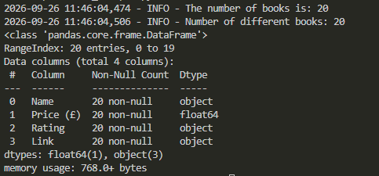

# Books Scraper — Web Scraping & Data Cleaning with Python
Extracts data for 20 books (name, price, rating, and link) from the homepage of books.toscrape.com, processes it fully with pandas (cleaning and organizing), and exports it cleanly to a CSV file.



___

## ✨ Features :
- Clean, structured CSV output; ready to use in other programs or analyses
- Books sorted automatically from cheapest to most expensive
- Price, rating, and direct link for each book displayed clearly in one row
- Reliable error handling; the script won't crash on network issues or missing data
___

## ✨ Prerequisites :
- **Python +3.8**
- **Git**
___

## ✨ Installation :
1. Clone the project :
```bash
git clone https://github.com/Zino0003/books-scraper.git
cd books-scraper
```
2. Creating the virtual environment (books_scraper_venv) and activate it :
```bash
python -m venv books_scraper_venv
```
- Activate on Windows (Git Bash) :
```bash
source books_scraper_venv/Scripts/activate
```
- Activate on Windows (CMD / PowerShell) :
```bash
books_scraper_venv\Scripts\activate
```
- Activate on macOS / Linux :
```bash
source books_scraper_venv/bin/activate
```
3. Install the libraries :
```bash
pip install -r requirements.txt
```
___

## ✨ Usage : 
- Run the code :
```bash
python books_scraper.py
```
The script will:
1. Scrape book data (name, price, rating, and link) from books.toscrape.com
2. Clean and process the data using pandas
3. Sort the books by price (cheapest to most expensive)
4. Export the final results to `Books_scraping.csv`

A log file (`books_scraper.log`) will also be created, recording the scraping process and any errors encountered.
### Sample Output (Books_scraping.csv)

| Name | Price (£) | Rating | Link |
|---|---|---|---|
| Set Me Free | 17.46 | Five | catalogue/set-me-free_988/index.html |
| Olio | 23.88 | One | catalogue/olio_984/index.html |
| Soumission | 50.10 | One | catalogue/soumission_998/index.html |
____

## ✨ Project Structure :
```text
books-scraper/
├── books_scraper.py      # Main script (scraping)
├── requirements.txt      # Python dependencies
├── Books_scraping.csv    # Sample output (cleaned)
├── Attached_files/       # Output screenshots
├── LICENSE               # License file
├── .gitignore            # Git ignore rules
└── README.md             # Project documentation
```
___

## ✨ Built With :
- [Python 3.8+](https://www.python.org/) — core programming language
- [Requests](https://requests.readthedocs.io/) — for sending HTTP requests
- [BeautifulSoup4](https://www.crummy.com/software/BeautifulSoup/) — for parsing HTML and extracting data
- [lxml](https://lxml.de/) — fast HTML parser used with BeautifulSoup
- [pandas](https://pandas.pydata.org/) — for data cleaning, processing, and export
- [Logging](https://docs.python.org/3/library/logging.html) — built-in module for structured event logging
___

## ✨ License :
Distributed under the MIT License. See [LICENSE](LICENSE) for more information.
___

## ✨ Contact :
**Mr. Zine elabidine ABDELOUAHAB** 
- **LinkedIn Profile:** [Click here](https://www.linkedin.com/in/zine-abdelouahab) 
- **Email:** abdelouahabzineelabidine@gmail.com

Project Link: [GitHub Repository](https://github.com/Zino0003/books-scraper)

